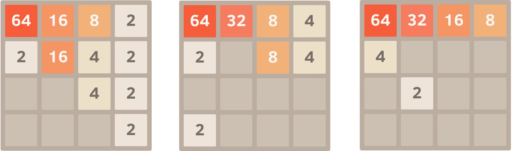
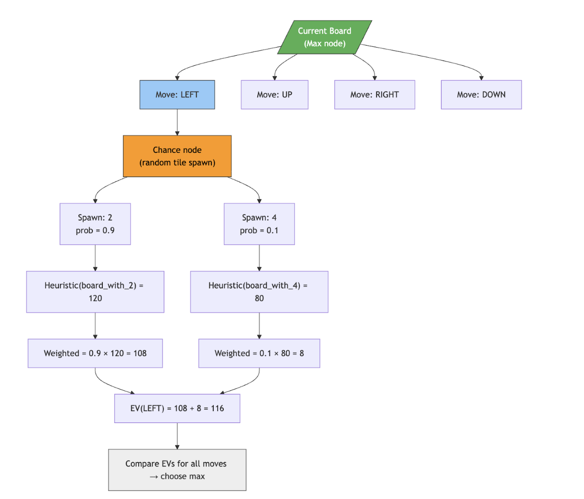
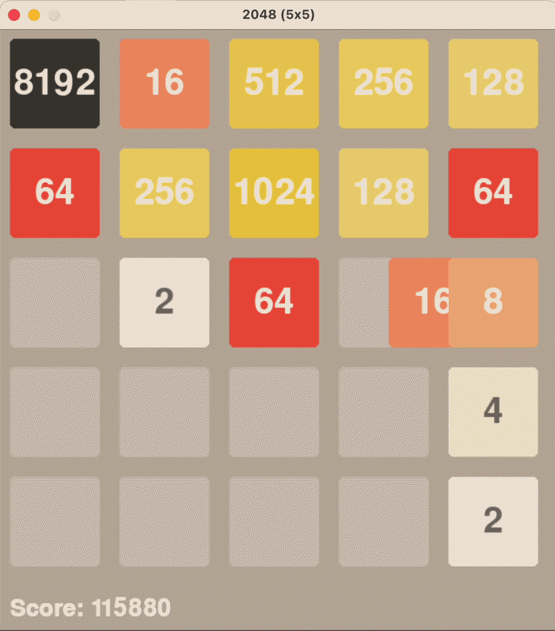
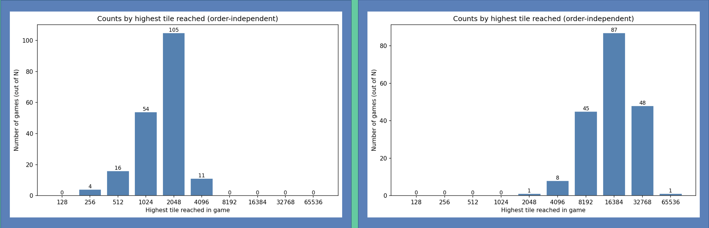
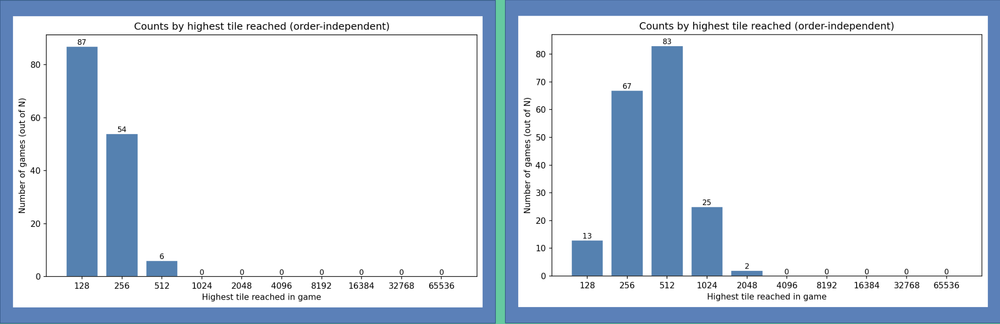
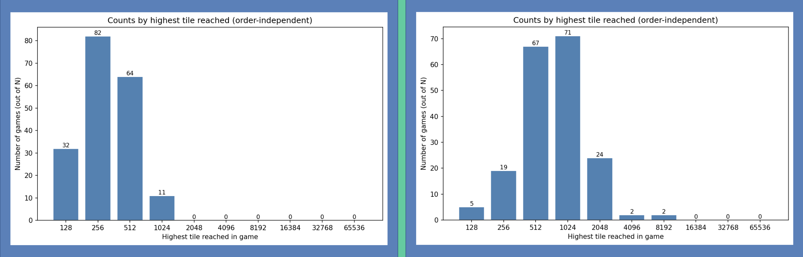

# Project Summary
2048 is a single-player puzzle game played on a 4×4 grid. At each turn, the player slides all tiles in one of four directions (up, down, left, or right) and matching tiles merge to double in value. A new tile spawns randomly after every move, and the game ends when no valid moves remain. The goal is to reach the 2048 tile, though skilled play can go well beyond it.

While the rules are simple, 2048 is a surprisingly difficult problem for AI. It requires long-term planning and strategic tile management where you can't just focus on the next move, you have to think several steps ahead. Tiles also spawn randomly after each move, creating uncertainty that makes it impossible to plan a fixed strategy. On top of that, the large number of possible board states means you can't hard-code a solution that works every time.

This is why we propose using AI to tackle the problem. We evaluate three approaches: Expectimax, which uses tree search to plan ahead and account for random tile spawns; Deep Q-Network (DQN), which learns a strategy entirely from experience through reinforcement learning; and a hybrid model where DQN is pretrained on Expectimax-generated decisions before being fine-tuned with RL. By comparing all three, we can study how planning depth, learned value approximation, and expert-guided initialization each contribute to solving the game.

# Approach
Our approach evaluates three different methods for learning to play 2048: a search-based Expectimax agent, a reinforcement-learning agent trained directly with DQN, and a hybrid model where DQN is pretrained on Expectimax-generated decisions. Running all three allows us to isolate the strengths and weaknesses of planning, reinforcement learning, and imitation-based learning within the same environment.

For Expectimax, we use depth-limited search with heuristic evaluation to select expert actions. These expert trajectories provide high-quality training samples of the form (st, at), which we collect across 500 full games. For the pure DQN agent, data collection comes from its own ε-greedy interactions with the environment; each transition (st,at,rt,st+1) is stored in a replay buffer of size 100,000. Both DQN agents use the same state representation: the 4×4 board is flattened into a 16-dimensional vector where each tile is transformed using log⁡2 scaling (empty → 0). The DQN outputs four Q-values corresponding to the possible actions.

The network is optimized using the standard Q-learning temporal-difference loss:

$$
L = \left( Q_\theta(s_t, a_t) - \left[ r_t + \gamma \max_{a'} Q_{\theta^-}(s_{t+1}, a') \right] \right)^2
$$

with γ=0.99, Adam optimizer (learning rate 1 × 10^ −4) minibatch size 64, and target-network updates every 1,000 steps. For the imitation-trained DQN, we first minimize a supervised cross-entropy loss to match Expectimax’s actions before switching to reinforcement learning for fine-tuning. We additionally apply light reward shaping during RL training (penalty for invalid moves, positive reward for merges, and increased empty tiles) to improve stability.

This setup ensures that each agent follows the same interface (same state encoding, action space, and environment dynamics), which allows for clean, reproducible comparisons. By evaluating Expectimax, pure DQN, and Expectimax-trained DQN under identical conditions, we can study how planning depth, learned value approximation, and expert-guided initialization influence performance, stability, and generalization across different game states.

## How Expectimax works
Expectimax is an algorithm based on MiniMax, which is a tree based algorithm designed for two player games such as chess or backgammon. In the game of 2048, we assume the opposing player is the computer that chooses where a single spawn after each move (the one element of randomness in this game). With MiniMax, we assume that the opposing player will always make the optimal move. However, in 2048, this is not an accurate representation, as the computer chooses the location of the spawn tile randomly. 

To account for this, expectimax incorporates an average tile as the opposing player, which models the average of different possibilities for spawn locations and spawn values (2 with 90% chance and 4 with 10% chance). Using a scoring function, each hypothetical board state is given a score, determined by various heuristics. These board scores are averaged across possibilities to attain a chance node score which is inserted into the tree. 

Markdown code for General Expectation Formula:

$$
\text{EV} = \sum_i P(\text{outcome}_i) \cdot V(\text{outcome}_i)
$$

Where:
- $$P(\text{outcome}_i)$$ is the probability of a specific spawn
- $$V(\text{outcome}_i)$$ is the value of the resulting board

The tree is then traversed to a certain depth (we found depth 3 to be the best balance of performance and accuracy in our case) to choose the move that maximizes score. 

### Heuristics used
To evaluate the score of a particular board, we used a weighted combination of several heuristics. 

*Empty tile heuristic*

Boards with more empty spaces are better because they allow more possible merges and reduce the probability of losing when a random tile appears. Solvers therefore reward states with many empty cells. This heuristic is simple but strongly correlates with long-term survivability.

*Monotonicity*

Strong boards usually arrange tiles in a monotonic gradient (e.g., highest tile in a corner with values decreasing along rows/columns). This structure keeps large tiles together and promotes future merges instead of scattering values across the board.

$$
H_{mono}(s) =
\sum_{i,j} \max(board_{i,j} - board_{i+1,j}, 0)
+
\sum_{i,j} \max(board_{i,j} - board_{i,j+1}, 0)
$$

*Smoothness*

Smooth boards (neighboring tiles with similar values) are desirable because they make merges easier. Large differences between adjacent tiles suggest the board is fragmented and merges will be difficult.

$$\[
H_{smooth}(s) =
-\sum_{(i,j)\sim(k,l)} \left| \log_2(board_{i,j}) - \log_2(board_{k,l}) \right|
\]$$

*Corner Bias*

We add a large bonus for keeping the largest tile in the top left corner of the board, which allows for easier merges. 

By applying a log scale to all of these heuristics and watching several games, we were able to tune the weights of the heuristics. 

<table style="width:100%; border-collapse: collapse; font-family: Arial;">
  <thead>
    <tr style="background-color:#f2f2f2;">
      <th style="border:1px solid #ddd; padding:8px;">Heuristic</th>
      <th style="border:1px solid #ddd; padding:8px;">Weight</th>
      <th style="border:1px solid #ddd; padding:8px;">Description</th>
    </tr>
  </thead>
  <tbody>
    <tr>
      <td style="border:1px solid #ddd; padding:8px;">Empty Tiles</td>
      <td style="border:1px solid #ddd; padding:8px;">2.7</td>
      <td style="border:1px solid #ddd; padding:8px;">
        Rewards board states with more empty cells. More open spaces reduce the chance of losing
        and increase the probability that useful merges will occur in future moves.
      </td>
    </tr>
    <tr>
      <td style="border:1px solid #ddd; padding:8px;">Monotonicity</td>
      <td style="border:1px solid #ddd; padding:8px;">1.5</td>
      <td style="border:1px solid #ddd; padding:8px;">
        Encourages the board to follow a decreasing gradient from a corner, keeping large tiles clustered.
      </td>
    </tr>
    <tr>
      <td style="border:1px solid #ddd; padding:8px;">Smoothness</td>
      <td style="border:1px solid #ddd; padding:8px;">1.0</td>
      <td style="border:1px solid #ddd; padding:8px;">
        Penalizes large differences between neighboring tiles to encourage merge opportunities.
      </td>
    </tr>
    <tr>
      <td style="border:1px solid #ddd; padding:8px;">Corner Bias</td>
      <td style="border:1px solid #ddd; padding:8px;">2.0</td>
      <td style="border:1px solid #ddd; padding:8px;">
        Rewards states where the largest tile stays in a corner to maintain board stability.
      </td>
    </tr>
  </tbody>
</table>

### Deep Q Learning:
Deep Q Learning (DQN) is a value-based reinforcement learning algorithm. Instead of searching a game tree like Expectimax, DQN learns a function that directly predicts the long-term value of each move from a given board state.

At each step:
- The agent observes the current 4x4 board.
- The board is converted into a 16-dimensional vector using log2 scaling.
- A neural network outputs the four Q-values:
  - Q(s, up)
  - Q(s, down)
  - Q(s, left)
  - Q(s, right)
- The agent selects the action with the highest predicted Q-value (or a random action during exploration).

Instead of computing expectations over spawn possibilities like Expectimax, DQN learns these values directly through experience.

<u>Q-Learning Update Rule:<u>

The network is trained using this equation:  Q(s,a)←r+γa′max​Q(s′,a′)
- r is the immediate reward
- γ is the discount factor
- s′ is the next board state 

Each transition (sₜ, aₜ, rₜ, sₜ₊₁) is stored in a replay buffer of size 100,000. The network is optimized using the Adam optimizer (lr =1 × 10^ −4)), minibatch size 64, and target-network updates every 1,000 steps.

<u>State Representation:<u>

The 4x4 board is transformed as: tile value v→log2​(v)

Empty tiles are represented as 0. This helps compress large tile numbers into more stable numeric values.

<u>Rewards:<u>

To guide learning, we modified the reward to include an invalid move penalty, a merge reward of log₂, an empty tile bonus, a terminal bonus, a monotonicity reward to encourage ordered tile arrangement, and a positional reward for keeping the highest tile in the top left corner.

### Deep Q Learning on Expectimax: 
Deep Q-Learning on Expectimax combines search-based planning with function approximation.
Instead of learning purely from random gameplay, the model is trained using decisions generated by an Expectimax agent.

To generate training data, we ran 500 full games using Expectimax and used the data to train a neural network to imitate Expectimax’s decisions

At each step:
- The current 4×4 board is observed
- The board is converted into a 16-dimensional vector using log₂ scaling
- The neural network outputs four Q-values: Q(s, up), Q(s, down), Q(s, left), Q(s, right)
- The agent selects the action with the highest predicted value

Instead of performing a full tree search at runtime, the trained model approximates Expectimax behavior in a single forward pass. The model is first trained with a supervised cross-entropy loss to match Expectimax's actions, then fine-tuned using standard RL with the Adam optimizer (lr = 1 × 10^ −4)), minibatch size 64, and target-network updates every 1,000 steps.

<u>State Representation:<u>

Tile value transformation:
v → log₂(v)
- Empty tiles are represented as 0
- Log scaling stabilizes large tile magnitudes

<u>Key Advantage:<u>

The model learns a strong search-based strategy while eliminating the need for expensive tree expansion at runtime.

## 5x5 Games

To challenge our algorithms, we experimented with having them play on a 5x5 board. With significantly more tiles available (a 5x5 game has 25 tiles in contrast with the 16 in a 4x4 game), our algorithms proved they were able to achieve much higher scores. Observations of the playstyle of the game revealed several fallacies in our heuristic weighting, which we were then able to adjust. 

# Evaluation
## Expectimax Performance

For expectimax, the agent was able to reach the 2048 tile in about 61 percent of games. This demonstrates that the Expectimax strategy combined with our heuristics was fairly strong and capable of consistently achieving the win condition on the standard board size.

For 5x5, because the board is larger, there is significantly more blank space available for tiles to move and combine. As a result, the algorithm is able to reach much higher maximum tiles than in the standard game. The additional space allows the agent to build larger chains of merges before the board fills up, leading to much higher achievable tile values.

## DQN Performance

For Pure DQN, the 4x4, we see that the agent reaches the 512 tile occasionally, which occurs in about 3.2 percent of games. While the model can learn useful behaviors, it struggles to consistently reach higher tiles compared to more structured approaches. This reflects the challenge of learning effective strategies in 2048 using reinforcement learning alone, where the agent must discover good board structures purely from reward signals.

## DQN on Expectimax Performance

For the 4×4 board on the left, the hybrid model performs somewhat better than the pure DQN, reaching a maximum tile of 1024 in about 5.8 percent of games. By learning from Expectimax gameplay, the model is able to imitate stronger strategies than it would discover through reinforcement learning alone. On the right side, we observe tiles as large as 8192 being achieved. This demonstrates that the hybrid approach can learn useful strategic behavior while benefiting from the flexibility of a learned model.

## More Insights

One key insight from our experiments is that Expectimax consistently performs the best, but it comes with a very large computational cost. Running 190 games with Expectimax took approximately 8 to 9 days, since the algorithm performs a full tree search at every move. In contrast, the DQN trained on Expectimax can run the same 190 games in about 10 minutes, because it replaces the expensive tree search with a single forward pass through a neural network. This highlights a key tradeoff between performance and computational efficiency: search-based methods can achieve stronger play but are significantly slower than learned approximations.

Another takeaway from our experiments is the difference between hand-designed strategies and learned strategies. Expectimax performs well largely because we explicitly encoded strong heuristics into the evaluation function. To help the DQN learn a similar structure, we experimented with reward shaping to guide the learning process. One reward encourages the agent to keep the largest tile in the top-left corner, which stabilizes the board and prevents the largest tile from becoming trapped. Another reward encourages monotonicity, where tile values decrease smoothly across rows or columns in a snake-like pattern. This structure helps the agent maintain future merge opportunities and avoid breaking the board into chaotic tile configurations.

# Resources Used: 
- Core Libraries: numpy, torch, random, matplotlib, pygame
- Used a Python implementation of the 2048 game as an example for Gemini
- Utilized PyGame and Numpy for the implementation of the 2048 Game, along with the expectimax and DQN algorithm
- We utilized sHPC to run ~500 expectimax games for training DQN
- DQN Resource: https://github.com/dennybritz/reinforcement-learning/tree/master/DQN
- AI Usage
  - Used Gemini and ChatGPT to brainstorm potential algorithms that could be used for 2048, along with intuition behind how they work. 
  - Used Gemini to simplify an existing implementation of 2048 and configure it for use with AI agents

