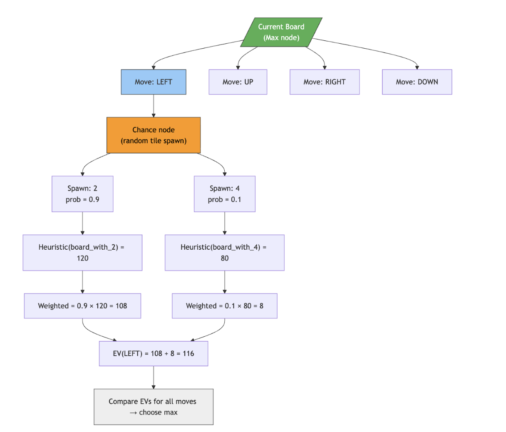

## Summary
We will begin by implementing an Expectimax-based agent for 2048 and use it as an expert to generate high-quality gameplay trajectories. Using these expert state–action pairs, we will train a simple neural network through imitation learning and then refine this model using a Deep Q-Network (DQN) to incorporate long-term reward feedback. This hybrid Expectimax→DQN pipeline allows us to create a fast learned policy that initially imitates expert play but can potentially outperform it through reinforcement learning. Our approach also enables us to study how different game conditions and board structures influence both planning-based and DQN-based decision-making.

## Approach
Our approach evaluates three different methods for learning to play 2048: a search-based Expectimax agent, a reinforcement-learning agent trained directly with DQN, and a hybrid model where DQN is pretrained on Expectimax-generated decisions. Running all three allows us to isolate the strengths and weaknesses of planning, reinforcement learning, and imitation-based learning within the same environment.

For Expectimax, we use depth-limited search with heuristic evaluation to select expert actions. These expert trajectories provide high-quality training samples of the form (st, at), which we collect across 500 full games. For the pure DQN agent, data collection comes from its own ε-greedy interactions with the environment; each transition (st,at,rt,st+1) is stored in a replay buffer of size 100,000. Both DQN agents use the same state representation: the 4×4 board is flattened into a 16-dimensional vector where each tile is transformed using log⁡2 scaling (empty → 0). The DQN outputs four Q-values corresponding to the possible actions.

The network is optimized using the standard Q-learning temporal-difference loss:

$$
L = \left( Q_\theta(s_t, a_t) - \left[ r_t + \gamma \max_{a'} Q_{\theta^-}(s_{t+1}, a') \right] \right)^2
$$

with γ=0.99, Adam optimizer (learning rate 1 × 10^ −4) minibatch size 64, and target-network updates every 1,000 steps. For the imitation-trained DQN, we first minimize a supervised cross-entropy loss to match Expectimax’s actions before switching to reinforcement learning for fine-tuning. We additionally apply light reward shaping during RL training (penalty for invalid moves, positive reward for merges, and increased empty tiles) to improve stability.

This setup ensures that each agent follows the same interface (same state encoding, action space, and environment dynamics), which allows for clean, reproducible comparisons. By evaluating Expectimax, pure DQN, and Expectimax-trained DQN under identical conditions, we can study how planning depth, learned value approximation, and expert-guided initialization influence performance, stability, and generalization across different game states.

## Evaluation
### How Expectimax Works:
Expectimax is an algorithm based on MiniMax, which is a tree based algorithm designed for two player games such as chess or backgammon. In the game of 2048, we assume the opposing player is the computer that chooses where a single spawn after each move (the one element of randomness in this game). With MiniMax, we assume that the opposing player will always make the optimal move. However, in 2048, this is not an accurate representation, as the computer chooses the location of the spawn tile randomly. 

To account for this, expectimax incorporates an average tile as the opposing player, which models the average of different possibilities for spawn locations and spawn values (2 with 90% chance and 4 with 10% chance). Using a scoring function, each hypothetical board state is given a score, determined by various heuristics. These board scores are averaged across possibilities to attain a chance node score which is inserted into the tree. 
 

### Deep Q-Learning
Deep Q Learning (DQN) is a value-based reinforcement learning algorithm. Instead of searching a game tree like Expectimax, DQN learns a function that directly predicts the long-term value of each move from a given board state.

At each step:
1. The agent observes the current 4x4 board.
2. The board is converted into a 16-dimensional vector using log2 scaling.
3. A neural network outputs the four Q-values:
  - Q(s, up)
  - Q(s, down)
  - Q(s, left)
  - Q(s, right)
4. The agent selects the action with the highest predicted Q-value (or a random action during exploration).

Instead of computing expectations over spawn possibilities like Expectimax, DQN learns these values directly through experience.

<u>Q-Learning Update Rule:</u>

The network is trained using this equation:  Q(s,a)←r+γa′max​Q(s′,a′)

- r is the immediate reward
- γ is the discount factor
- s′ is the next board state 

<u>State Representation:</u>

The 4x4 board is transformed as: tile value v→log2​(v)
Empty tiles are represented as 0. This helps compress large tile numbers into more stable numeric values.

<u>Rewards:</u>
To guide learning, we modified the reward to have an invalid move penalty, a merge reward of log2, empty tile bonus, and terminal bonus. 

